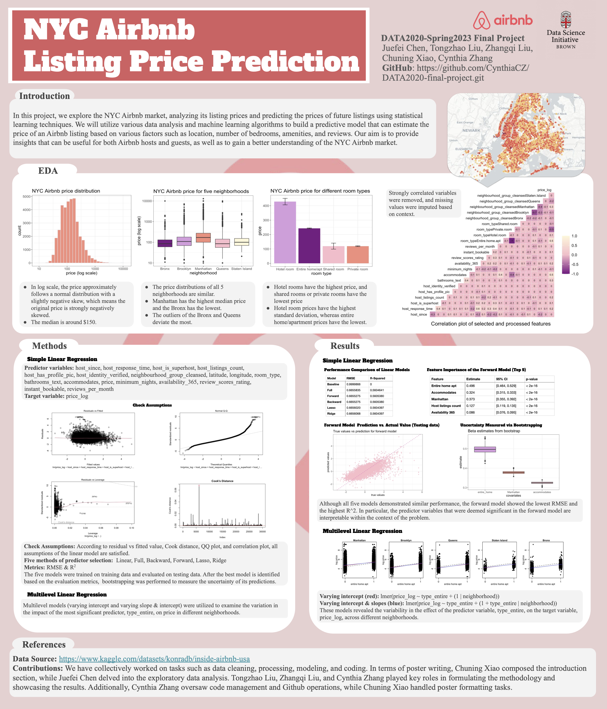

# Airbnb Data Prediction

## Summary
This study utilizes various data analysis and machine learning algorithms to build a predictive model that can estimate the price of an Airbnb listing based on various factors such as location, number of bedrooms, amenities, and reviews.

## Programming Languages
The analysis is conducted using programming techniques applicable in both **R and Python** environments.

## Methods
The core statistical method used in this project is **Linear Regression**. This approach is selected for its effectiveness in predicting outcomes based on linear relationships between variables.

## Key Components
- **Data Preprocessing:** Techniques applied to clean and prepare the data for analysis.
- **Exploratory Data Analysis (EDA):** Utilizes visualization and statistical analysis to explore the data and uncover insights.
- **Modeling:** Employs Ridge Regression, Ridge Regression, and multilevel model to predict Airbnb prices, focusing on the relationship between various features and the target variable.

## Files and Folders
├── data: original and processed downloaded from Kaggle\
├── plots: plots and figures\
├── src: 
├──── Airbnb_predict.ipynb: data_cleaning, EDA, models, multilevel in python\
├──── data_cleaning.Rmd: download, clean, and process dataset\
├──── EDA.Rmd: exploratory data analysis\
├──── models.Rmd: linear models\
├──── multilevel.Rmd: multilevel models\
├── poster.pdf: presentation poster\
├── .gitignore\
├── LICENSE\
└── README.md

